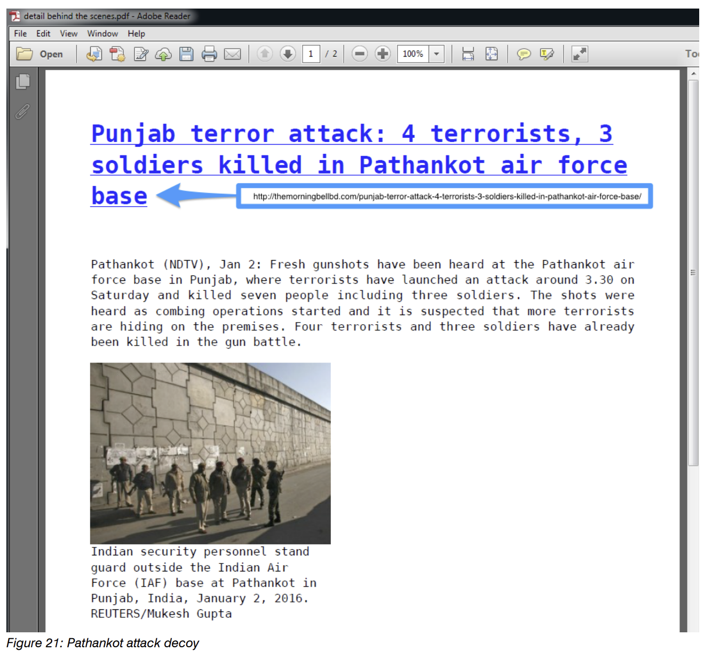
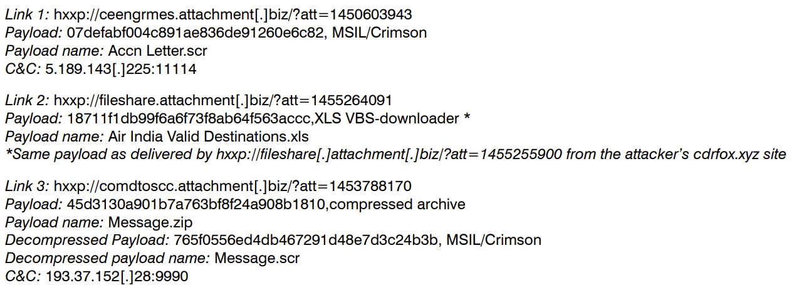
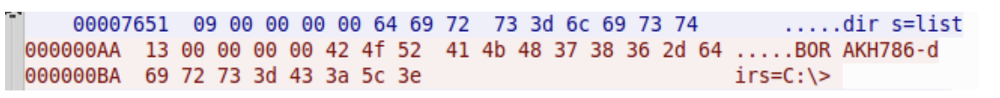
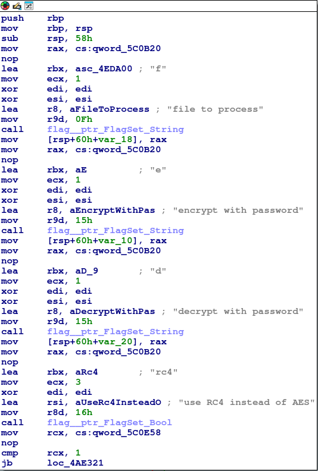

# APT-36

## 1. APT Attributes about APT36 ([link - proofpoint](https://www.proofpoint.com/sites/default/files/proofpoint-operation-transparent-tribe-threat-insight-en.pdf))

1. APT 36 ( aka: APT 36, APT36, C-Major, COPPER FIELDSTONE, Earth Karkaddan, Green Havildar, Mythic Leopard, ProjectM, Storm-0156, TMP.Lapis, Transparent Tribe )
2. Group targeting Indian Army or related assets in India, as well as activists and civil society in Pakistan. Attribution to a Pakistani connection has been made by TrendMicro and others.
3. It has been active since at least 2013, primarily targeting diplomatic, defense, and research organizations in India and Afghanistan.
4. On feb 11, 2016: 2 attacks a min apart from each other was directed towards at Indian enbassies in both Saudi Arabia and Kazakhstan.
5. Both e-mails were sent from the same originating IP (`5[.]189.170.84`) address ([link - github](https://github.com/BRANDEFENSE/IoC/blob/main/IoC-YARA-rules-apt36.txt#L58)). \
All Ip addresses can be found from here - [link - github](https://github.com/BRANDEFENSE/IoC/blob/main/IoC-YARA-rules-apt36.txt#L46)
6. The mails were likely via MailGun tool ([link](https://www.proofpoint.com/sites/default/files/proofpoint-operation-transparent-tribe-threat-insight-en.pdf) search: "MailGun").
8. In that particular Incident attachment was a weaponised RTF document utilizing [CVE-2012-0158 (BufferOverflow Vuln)](https://securelist.com/the-curious-case-of-a-cve-2012-0158-exploit/37158/) to drop an embedded, encoded portable exeutable (PE).
9. To decode the embedded PE:
    - the document's shellcode first searches for the `0xBABABABA` marker that, when found, will indicate the beginning positon of the PE. The PE is then decoded using the key `0xCAFEBABE`.
    - A final marker indicates the end of the PE file, which in this case, is the marker `0xBBBBBBBB`.
    
10. Fake Blog post named, "blogspot.com" site (`intribune.blogspot[.]com`) was created by same actor to lure Indian Military to become infected by `Crimson`, `njrat` and others. \
More Softwares that are used by APT36 can be found [here - MITRE attack groups](https://attack.mitre.org/groups/G0134/) (search: "Software").
11. The actors used hyperlinks via an image or text or via an iframe to redirect victims to download malicious payloads.
12. Lure Articles:
    
    1. 
    
    
    2. 
    

    3.
    

    4. 
    

    5.
    

    6.
    
    
    


14. Cluster Analysis on MSIL/Crimson Implant (including only `APT36 Operations`):
    1. Samples dating back to 2012. Begins with embassy phishing and the fake Indian‐news blog (`intribune[.]blogspot[.]com`). Tools include Crimson plus _Luminosity Link RAT_, _njRAT_, _Bezigate_, _Meterpreter_, and a closely related _Python/Peppy RAT_; _Andromeda_ downloaders also appear.
    2. Infra patterns: Mix of compromised and actor-owned domains (e.g., `sahirlodhi[.]com` and `bbmsync2727[.]com`). Naming tells: “sync” strings, repeated use of “bb/bbm,” and second-level domains ending in 4 digits. Heavy use of Contabo GmbH hosted C2.
    3. Another Email Campaign using "2016 [Pathankot attack](https://en.wikipedia.org/wiki/2016_Pathankot_attack)" Lure ([link](https://www.proofpoint.com/sites/default/files/proofpoint-operation-transparent-tribe-threat-insight-en.pdf)) (search: "`Email Campaign using "2016 Pathankot attack" Lure`")
    - 
    - 
    - 
    - 
    - 

    1. **ATTACHMENT.BIZ domain**
      - fileshare.attachment[.]biz
      - comdtoscc.attachment[.]biz
      - ceengrmes.attachment[.]biz
      - email.attachment[.]biz (no links discovered) \
    All of the domains resolve to the same IP, 91.194.91[.]203 (Contabo GmbH). So far three separate campaigns was detected.

        

    2. **AFOWOBLOG.IN Domain**
       - The domain was registered on or near February 24th, 2016 using the email address `thefriendsmedia@gmail.com`, which is also close to the same day that the “AFOWO Broucher 2016.xls” attachment was uploaded to VT.
       - We have detected potentially connected activity as far back as June 2013 using the domain `thefriendsmedia[.]com`, where it was used as an Andromeda C&C.
       - _Andromeda payload_ communicate with `brooksidebiblefellowship[.]org` to retrieve an _additional Andromeda payload_ from `lolxone[.]com` that then used `thefriendsmedia[.]com` as its C&C.
       - The original _Andromeda_ also retrieved a _Bezigate payload_.
         
       - It was observed `lolxone[.]com` hosting additional _Bezigate payloads_ as well as the _Python/Peppy malware_.
         
         
    More Cluster Analysis on _MSIL/Crimson_ Implant can be found here:
    https://www.proofpoint.com/sites/default/files/proofpoint-operation-transparent-tribe-threat-insight-en.pdf (search: "`Cluster 2 — guddyapps / appstertech / sajid`" and "`Cluster 3 — “Nadra attack in Mardan” lures`" and "`Cluster 4 — DDNS & Pakistan`")

15. Technical Analysis:
    - Crimson is modular in the sense that additional payloads downloaded by the main RAT module are often utilized to perform functions such as keylogging and browser credential theft.
    - Crimson infections also typically occur in stages. Crimson’s first stage is a downloader component whose primary purpose is to download a more fully featured RAT, typically being the Crimson RAT component. The RAT component will then send system information to the C&C while the C&C will likely respond with additional module payloads.
    - Crimson utilizes a custom TCP protocol for communicating to C&C. Some of Crimson’s optionally downloaded modules have no C&C capability and instead rely on the RAT component for information exfiltration.
    - 
    - Some Crimson RAT variants support at least 40 individual commands, while all the individual commands throughout the different versions of the RAT we researched are listed.

| Table 1 | Table 2 |
| ------- | ------- |
|  |  | 

15. **MSIL/Crimson Module Analysis**:
    - These modules include :
        - keylogging,
        - browser credential theft,
        - automatic searching
        - and stealing of files on removable drives, and two different payload update modules.
        - Lastly, there appears to be a module referred to as “remvUser” that we have not been able to locate.
     
    - More can be found here: https://www.proofpoint.com/sites/default/files/proofpoint-operation-transparent-tribe-threat-insight-en.pdf (search: "MSIL/Crimson Module Analysis")

16. **Crimson Server** ([link](https://securelist.com/transparent-tribe-part-1/98127/)):
- It was found two different server versions. The one being a version that we named “A”, compiled in 2017, 2018 and 2019, and including a feature for installing the USBWorm component and executing commands on remote machines.
- The version that was named “B” was compiled in 2018 and again at the end of 2019. The existence of two versions confirms that this software is still under development and the APT group is working to enhance it.
- Securelist, analysed the .NET binary, and were able to set up a working environment and communicate with samples previously detected on victims’ machines.

### Crimson Server version “A”:

1. Main Panel:


Geolocation information is retrieved from a legitimate website using a remote IP address as the input. The URL used by the server is: `http://ip-api.com/xml/<ip>`

The server uses an embedded configuration specified inside a class named “settings”.


2. Bot panel:
The main features are accessible from the “bot panel”, an interface with twelve tabs, which can be used to manage a remote system and collect information.

- Update module:
  - The first tab is used for checking the client configuration, uploading Crimson components and executing these on remote system.
  - 
  - The Crimson framework is composed of seven client components:
    - **Thin Client**: It is usually dropped during the infection process by which Transparent Tribe is distributed.
        - It contains a limited number of features and can typically be used to:
        - collect information about infected system
        - collect screenshots
        - manage the remote filesystem
        - download and upload files
        - get a process list
        - kill a process
        - execute a file
    - **Main Client**: the full-featured RAT. It can handle all “Thin Client” features, but it can also be used to:
        - install the other malware components
        - capture webcam images
        - eavesdrop using a computer microphone
        - send messages to the victim
        - execute commands with COMSPEC and receive the output.
    - **USB Driver**: a USB module component designed for stealing files from removable drives attached to infected systems.
    - **USB Worm**: This is the USBWorm component developed for stealing files from removable drives, spread across systems by infecting removable media, and download and execute the “Thin Client” component from a remote Crimson server.
        - On January 2020, there was an Ongoing Campaign launched by Transparent Tribe to distribute the Crimson malware. The attacks started with malicious Microsoft Office documents, which were sent to victims using spear-phishing emails ([link](https://securelist.com/transparent-tribe-part-1/98127/)).
        - The documents typically have malicious VBA code embedded, and sometimes protected with a password, configured to drop an encoded ZIP file which contains a malicious payload.
        - Decoy document used in an attack against Indian entities:
            - 
        - User form with encoded payloads:
            - 
        - The macro drops the ZIP file into a new directory created under %ALLUSERPROFILE% and extracts the archive contents at the same location. The directory name can be different, depending on the sample:
            - `%ALLUSERSPROFILE%\Media-List\tbvrarthsa.zip`
            - `%ALLUSERSPROFILE%\Media-List\tbvrarthsa.exe`
            - 
        - During the analysis of by securelist: they found one of the file path name combinations observed was `‘C:\ProgramData\Dacr\macrse.exe’`, also configured in a Crimson “Main Client” sample and used for saving the payload received from the C2 when invoking the usbwrm command.
        - 
        - **USB Worm description**:
        1. Usually, the component is installed by the Crimson “Main Client”, and when started, it checks if its execution path is the one specified in the embedded configuration and if the system is already infected with a Crimson client component (Probably used Mutex of some kind to check this: what reveng007 think!).
        2. If these conditions are met, it will start to monitor removable media, and for each of these, the malware will try to infect the device and steal files of interest.
        3. The infection procedure lists all directories. Then, for each directory, it creates a copy of itself in the drive root directory using the same directory name and changing the directory attribute to “hidden”. This results in all the actual directories being hidden and replaced with a copy of the malware using the same directory name.
        4. Moreover, **USBWorm** uses an icon that mimics a Windows directory, tricking the user into executing the malware when trying to access a directory.
        5. USBWorm icon:
            - 
        6. This simple trick works very well on default Microsoft Windows installations, where file extensions are hidden and hidden files are not visible.
        7. The victim will execute the worm every time he tries to access a directory. Moreover, the malware does not delete the real directories and executes “explorer.exe” when started, providing the hidden directory path as argument. The command will open the Explorer window as expected by the user.
        8. View of infected removable media with default Windows settings:
            - 
        9. View of infected removable media with visible hidden files and file extensions:
            - 
        10. The data theft procedure lists all files stored on the device and copies those with an extension matching a predefined list:
            - File extensions of interest: .pdf, .doc, .docx, .xls, .xlsx, .ppt, .pptx, .pps, .ppsx, .txt
            - If the file is of interest, i.e. if the file extension is on the predefined list, the procedure checks if a file with the same name already has been stolen. The malware has a text file with a list of stolen files, which is stored in the malware directory under a name specified in the embedded configuration.
            - This approach is a little buggy, because if the worm finds two different files with the same name, it will steal only the first one.
            - Anyway, if the file is of interest and is not on the list of stolen files, it will be copied from the USB to a local directory usually named “data” or “udata”, although the name could be different.
        11. If the worm is executed from a _removable media_, the behavior is different.
            - In this case, it will check if the “Thin Client” or the “Main Client” is running on the system. If the system is not infected, it will connect to a remote Crimson Server and try to use a specific “USBW” command to download and execute the “Thin Client” component.
            - Snippet of code used to build USBW request:
                - 
        12. **Persistence**: \
          1. It checks if the malware directory exists as specified in an embedded configuration and then copies the malware executable inside it. \
          2. It also creates a registry key under “`HKCU\SOFTWARE\Microsoft\Windows\CurrentVersion\Run`” to execute the worm automatically. 

        13. **USB Worm distribution**:
            - link: https://securelist.com/transparent-tribe-part-1/98127/ (search: "USB Worm distribution")

    - **Pass Logger**: A credential stealer, used for stealing credentials stored in the Chrome, Firefox and Opera browsers.
    - **KeyLogger**: this is simple malware used for recording keystrokes.
    - **Remover**: Not much information regarding this.
        - Transparent Tribe tries to circumvent certain vendors’ security tools by configuring the Server to prevent installation of some of the malware components, specifically the “USB Driver” and the “Pass Logger”, on systems protected with ***Kaspersky products*** and prevent installation of the “Pass Logger” on systems protected by ***ESET***.
        - 
    - **File Manager & Auto Download tabs**: The file manager allows the attacker to explore the remote file system, execute programs, download, upload and delete files.
        - 
        - The most interesting ones are “USB Drive” and “Delete USB”, used for accessing data stolen by the USB Driver and USB Worm components and the “Auto File Download” feature. This feature opens another window, which can also be accessed via the second last tab. It allows the attacker to configure the bot to search files, filter results and upload multiple files.
        - 
    - **Screen and Webcam monitoring tabs**:
        - Screen monitoring tab: \
            
        - Webcam monitoring tab: \
            
        - The other tabs are used for managing the following features:
            - Audio surveillance: The malware uses the NAudio library to interact with the microphone and manage the audio stream. The library is stored server-side and pushed to the victim’s machine using a special command.
            - Send message: The attacker can send messages to victims. The bot will display the messages using a standard message box.
            - Keylogger: Collects keyboard data. The log includes the process name used by the victim, and keystrokes. The attacker can save the data or clear the remote cache.
            - Password Logger: The malware includes a feature to steal browser credentials. The theft is performed by a specific component that enumerates credentials saved in various browsers. For each entry, it saves the website URL, the username and the password.
            - Process manager: The attacker can obtain a list of running processes and terminate these by using a specific button.
            - Command execution: This tab allows the attacker to execute arbitrary commands on the remote machine.
         
### Crimson Server version “B”:

- The other version is quite similar to the previous one. Most noticeably, in this “B” version, the graphical user interface is different.
- 
- “Update USB Worm” is missing from the Update Bot tab, which means that the USB Worm feature is not available in these versions.
- 
- This version does not include the check that prevents installation of certain components on systems protected with Kaspersky products, and the Command execution tab is missing. At the same position, we find a different tab, used for saving comments about the infected machine.
- 


------------------------------------------------------------------------------------------------------------------


## 2. APT Attributes about APT36 related to Sindoor Dropper: New Phishing Campaign : Linux Target ([link - nextron](https://www.nextron-systems.com/2025/08/29/sindoor-dropper-new-phishing-campaign/))

1. Nextron's analysis uncovered a phishing campaign targeting organizations in India, leveraging spear-phishing techniques reminiscent of Operation Sindoor.
2. It is a Linux-focused infection method that relies on weaponized **.desktop** files.
3. This technique has been linked to APT36 (aka Transparent Tribe, Mythic Leopard, G0134) in the past, suggesting the same group may be behind the campaign while also adapting its methods.
4. When opened, these `.desktop` files trigger a heavily obfuscated execution chain built to evade both static and dynamic detection. The chain ultimately delivers a [MeshAgent](https://github.com/Ylianst/MeshAgent) payload, which gives the attacker full remote access to the system. This access includes the ability to monitor activity, move laterally, and potentially exfiltrate data.
5. By combining localized spear-phishing lures with advanced obfuscation techniques, the adversaries increase their chances of bypassing defenses and gaining footholds in sensitive networks.
6. The malicious `.desktop` file is crafted to appear harmless by masquerading as a legitimate document. On the victim’s desktop, it displays an icon resembling a PDF file (image below), luring the user into executing it.
    - 
    - 
    - Upon launch, the file opens a benign-looking decoy PDF (image below) to reinforce the illusion of legitimacy.
7. While the user is focused on the opened document, a background process silently runs the obfuscated routines that initiate the deployment chain, ultimately installing the MeshAgent payload. This approach blends social engineering with stealth, hiding malicious activity behind what appears to be a harmless file.
    - 
    - 
8. By using a `.desktop` file, the attacker can place executable files on the victim’s system without needing elevated privileges (chmod).
9. Infection Chain Overview:
    - The following schema outlines the infection process from the initial .desktop file launch to the final MeshAgent deployment.
       - 
       - 
10. Process Analysis:
    - The original desktop file downloads the `decoy document`, a `corrupted decryptor`, and an `encrypted downloader`.
        - 
        - 
        - 1. Filename: `Note_Warfare_Ops_Sindoor.pdf.desktop` : Initial phishing payload
        - 2. Filename: `/tmp/Note_Warfare.pdf` : Decoy PDF Document
        - 3. Filename: `mayuw` : AES decryptor 
        - 4. Filename: `shjdfhd` : AES-CTR encrypted Stage2 (Stage2 downloader)
         
    - The decryptor is a Go binary packed using UPX. To avoid detection, this binary has its ELF magic bytes stripped off to evade scanning by the Google Docs platform. The magic bytes are restored on the fly by the .desktop file to make it executable again:
    ```
    printf '\x7FELF' | dd of=mayuw bs=1 count=4 conv=notrunc
    ```
    - This decryptor is responsible for AES decryption and execution of the payload. There is also an option to use DES instead of AES:
        - 
        - 
    - The decryption process is straightforward and can be achieved with the following command line:
    ```
    ./mayuw -f shjdfhd -d 'NIC0fficialDB_Auth' && rm -r mayuw && ./shjdfhd
    ```
    - Once decrypted, the second-stage payload is a UPX-packed Go dropper that drops another decryptor along with another AES-encrypted payload (with the password `WOrkiNgtoDesksSS8123whyme?youseethis`).
    - Dropper contains basic anti-VM tricks:
        1. The process checks that every value in `/sys/class/dmi/id/board_name`, `/sys/class/dmi/id/bios_vendor`, `/sys/class/dmi/id/board_vendor`, `/sys/class/dmi/id/sys_vendor`, and `/sys/class/dmi/id/product_name` does not match any of the following values: `VBOX_QEMU`, `QEMU`, `KVM_XEN`, `XEN`.
        2. The following MAC address prefixes are blacklisted:
            - 00:05:69
            - 00:0c:29
            - 00:1c:14
            - 00:50:56
            - 08:00:27
            - 00:15
        3. It attempts to execute the following processes to check if it is inside a VM:
            - vboxservice
            - vboxtray
            - vmtoolsd
            - vmwaretray
            - xenservice
         
        3. The dropper checks that `/etc/os-release` does not contain any of the following values: `boss`, `vbox`, `qemu`, `KVM_`, `XEN_`.
        4. The machine’s uptime must be over 10 minutes to continue execution.

    - All strings are obfuscated using a combination of Base64 encoding and DES-CBC encryption:
        - 
        - 
    - The process repeats with another download and decryption stage, this time using the password `WOrkiNgtoDesksSS8123`:
        1. Filename: `access` : AES decryptor
        2. Filename: `inter_ddns` : Stage3 downloader \
      The decryption process concludes with the deployment of the final payload, a **MeshAgent**.

11. Mesh Agent:
    - The final payload delivered by the Sindoor dropper is a MeshAgent binary, a legitimate remote administration tool that has been repurposed for malicious use.
    - MeshAgent provides the attacker with full remote access to the compromised system, enabling a wide range of post-exploitation activities such as activity monitoring, lateral movement, data exfiltration, and persistent access.
        - File name: `server2` : MeshAgent
    - Once executed, the MeshAgent connects to its command and control (C2) server at:
    ```
    wss://boss-servers.gov.in.indianbosssystems.ddns[.]net:443/agent.ashx
    ```
    > All observed subdomains under `indianbosssystems.ddns[.]net` resolve to the IP address `54.144.107.42`.
    - Acc. to analysis, this command-and-control (C2) infrastructure is hosted on an Amazon Web Services (AWS) EC2 instance.
    - From `validin.com`, these subdomains were all registered on _2025-08-15_, suggesting a coordinated setup of the infrastructure immediately prior to the campaign’s activity.
    - This connection allows the attacker to issue _commands_, _transfer files_, and _maintain persistence_ on the infected host.
    - The use of a legitimate tool like `MeshAgent` complicates detection and response, as its functionality overlaps with legitimate remote administration.


-----------------------------------------------------------------------------------------------


## 3. APT Attributes about APT36 related to Operation Sindoor – Anatomy of a Digital Siege : Windows Target ([link - quickheal](https://www.quickheal.co.in/knowledge-centre/operation-sindoor-anatomy-of-a-digital-siege/))

1. Seqrite Labs has identified multiple cyber events linked to Operation Sindoor, involving state-sponsored APT activity and coordinated hacktivist operations.
2. Observed tactics included :
    - spear phishing,
    - deployment of malicious scripts,
    - website defacements,
    - and unauthorized data leaks.
3. The campaign exhibited a combination of cyber espionage tactics, hacktivist-driven disruptions, and elements of hybrid warfare.
4. It targeted high-value Indian sectors, including defense, government IT infrastructure, healthcare, telecom, and education.
5. Some of the activities were attributed to APT36 and Sidecopy, Pakistan-aligned threat groups known for leveraging spoofed domains, malware payloads, and credential harvesting techniques against Indian military and government entities.
6. On April 17, 2025: Anomalies directed towards government mail servers and defence infrastructures. Lure files carried names that mimicked urgency and legitimacy:
    - `Final_List_of_OGWs.xlam`
    - `Preventive_Measures_Sindoor.ppam`
    - `Pahalgam_Incident_Timeline.pptx.lnk`
    They were precision-guided attacks—documents with _macros_, _shortcuts_, and _scripts_ that triggered covert command-and-control (C2) communications and malware deployments. \
    Each lure played on public fear and national tragedy, weaponizing recent headlines like the Pahalgam Terror Attack. 
7. Following the initiation of Operation Sindoor on May 7th, a surge in hacktivist activities was observed, including coordinated defacements, data leaks, and disruptive cyber campaigns.
    - 
8. APT36: Evolution:
    1. APT36 group, known for phishing and the _Crimson RAT_, has upgraded its tooling. They’ve dropped their older “Poseidon” loaders and now lead with Ares, a more modular and stealthy malware framework, as the primary entry tool (“spearhead”) for their attacks.
    2. Tools & File Types:
        - .ppam, .xlam, .lnk, .xlsb, .msi
        - Macros triggering web queries: `fogomyart[.]com/random.php`
        - Payload delivery through spoofed Indian entities: `zohidsindia[.]com`, `nationaldefensecollege[.]com`, `nationaldefencebackup[.]xyz`
        - Callback C2 IP : `86.97[.]58:17854`
    3. Initial access was via spear phishing attachments (`T1566.001`) using malicious file types (.ppam, .xlam, .lnk, .xlsb, .msi). \
       These triggered macros executed web queries (`T1059.005`) to domains like `fogomyart[.]com`.
       Payloads were delivered through spoofed Indian domains such as `zohidsindia[.]com` and `nationaldefensecollege[.]com`, with C2 communication via application layer protocols (`T1071.001`) to `167.86.97[.]58:17854`.
       For execution and persistence, APT36 leveraged LOLBins (`T1218`), scheduled tasks (`T1053.005`), UAC bypasses (`T1548.002`), and obfuscated PowerShell scripts (`T1059.001`, `T1027`), enabling prolonged access while evading detection.
    4. Ares RAT grants full control over the compromised host offering capabilities such as :
       - `keylogging`
       - `screen capturing`
       - `file manipulation`
       - `credential theft`
       - and `remote command execution—similar to commercial RATs` but tailored for stealth and evasion.
      
9. Digital Infrastructure: Domains of Deception:
    - The operation’s domain arsenal resembled a covert intelligence operation:
        - `pahalgamattack[.]com`
        - `operationsindoor2025[.]in`
        - `sindoor[.]website`
        - `sindoor[.]live`
    - These domains mimicked military and government entities, exploiting user trust and leveraging geo-political narratives for social engineering.

10. Hacktivist Operations carried out in coordination with something else—another group or a parallel effort (e.g., propaganda, protests, or state ops)—timed to run together to amplify impact.
    - In parallel, hacktivist collectives coordinated disruptive attacks — **DDoS**, **defacements**, and **data leaks** — across key Indian sectors. Telegram groups synchronized actions under hashtags like `#OpIndia`, `#OperationSindoor`, and `#PahalgamAttack`.
    - 
    - 

11. Most Targeted Sectors:
    - 

12. IOCs: Indicators of Compromise:
```
Malicious Domains:

pahalgamattack[.]com
sindoor[.]live
operationsindoor2025[.]in
nationaldefensecollege[.]com
fogomyart[.]com/random.php

Malicious Files:

xlam
ppam
pptx.lnk
pdf

Callback IP:

86.97[.]58:17854 (Crimson RAT C2)

VPS Traffic Origination:

Russia
Germany
Indonesia
Singapore
```


## 4. Advisory: Pahalgam Attack themed decoys used by APT36 to target the Indian Government ([link - Seqrite Labs](https://www.seqrite.com/blog/advisory-pahalgam-attack-themed-decoys-used-by-apt36-to-target-the-indian-government/))
- More Information on PowerPoint PPAM dropper can be found here: https://www.seqrite.com/blog/advisory-pahalgam-attack-themed-decoys-used-by-apt36-to-target-the-indian-government/


Resources:
1. https://www.proofpoint.com/sites/default/files/proofpoint-operation-transparent-tribe-threat-insight-en.pdf
2. https://malpedia.caad.fkie.fraunhofer.de/actor/operation_c-major
3. https://securelist.com/transparent-tribe-part-1/98127/
4. https://github.com/BRANDEFENSE/IoC/blob/main/IoC-YARA-rules-apt36.txt
5. https://www.nextron-systems.com/2025/08/29/sindoor-dropper-new-phishing-campaign/
6. https://github.com/reveng007/APT-36/edit/main/README.md
7. 

Other Resources:
1. https://securelist.com/transparent-tribe-part-2/98233/
2. https://attack.mitre.org/groups/G0134/
3. https://blog.talosintelligence.com/transparent-tribe-infra-and-targeting/
    
    
    


    
